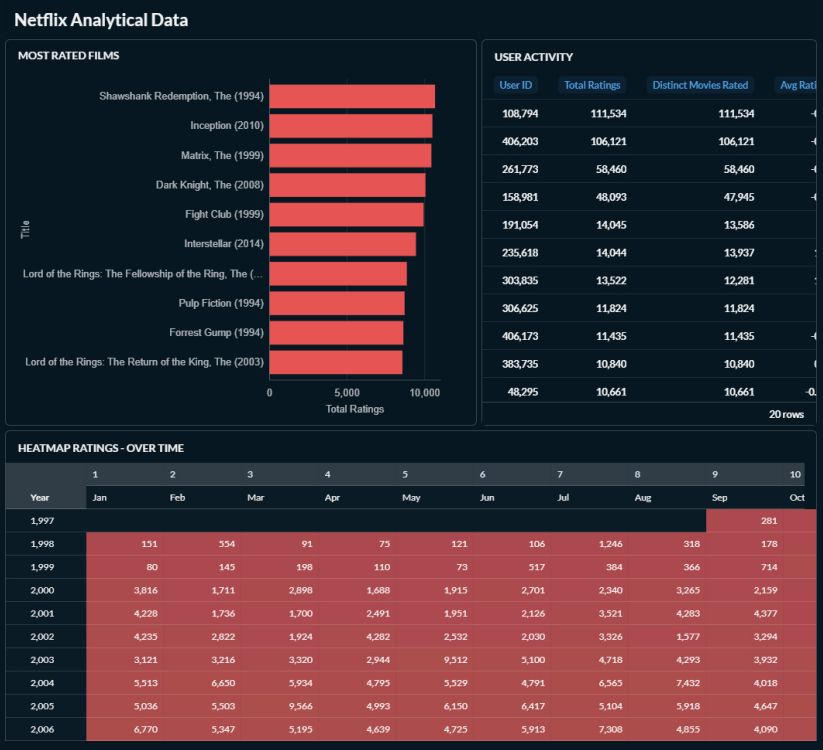
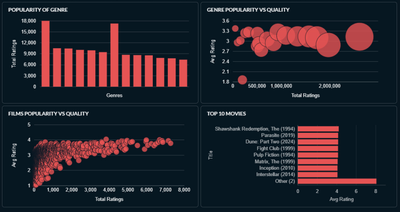

# Netflix Analytics Pipeline

End-to-end data engineering project built from scratch using real MovieLens data. Raw CSV files are ingested into Google Cloud Storage, modeled in BigQuery following a Star Schema, and visualized in a Metabase dashboard running locally via Docker.

---

## Architecture

```
CSV Files (MovieLens Beliefs Dataset)
          │
          ▼
Google Cloud Storage
gs://pedro-barbosa-netflix-data/bronze/
          │
          ▼
BigQuery — dataset: netflix_raw
(External Tables — direct read from GCS, no data duplication)
          │
          ▼
BigQuery — dataset: netflix_analytical
(Typed tables + analytical views — Star Schema)
          │
          ▼
Metabase (Docker)
Interactive dashboard
```

---

## Tech Stack

| Layer | Technology |
|---|---|
| Storage | Google Cloud Storage (GCS) |
| Data Warehouse | BigQuery (GCP) |
| Visualization | Metabase (Docker) |
| Language | SQL |

---

## Dataset

**MovieLens Beliefs Dataset** — collected between March 2023 and May 2024.

Contains real user ratings, system recommendations, and user belief predictions (how users think they would rate movies they haven't seen yet).

| File | Table | Description |
|---|---|---|
| `movies.csv` | `raw_movies` | Movie catalog (movieId, title, genres) |
| `user_rating_history.csv` | `raw_user_rating_history` | Real ratings by primary users |
| `user_additional_rating.csv` | `raw_ratings_for_additional_users` | Real ratings by additional users |
| `user_recommendation_history.csv` | `raw_user_recommendation_history` | System recommendation history |
| `movie_elicitation_set.csv` | `raw_movie_elicitation_set` | Movies used to elicit user predictions |
| `belief_data.csv` | `raw_belief_data` | Core table: real ratings + predicted ratings + user certainty |

Ratings use a **0.5 to 5.0** star scale. Timestamps are stored as **Unix epoch (seconds)**.

---

## Data Modeling

The analytical layer follows a **Star Schema**:

```
fact_ratings
├── user_id    → (no user dimension — users are anonymous)
├── movie_id   → dim_movies.movie_id
├── rating
├── rating_ts
└── src        ← traceability: 'user_rating_history' | 'additional_users'
```

### `dim_movies`
Movie dimension with typed columns. `release_year` is extracted from the title string using `REGEXP_EXTRACT`. Built with `SAFE_CAST` to handle raw STRING inputs safely.

### `fact_ratings`
Fact table built via `UNION ALL` of two raw sources. Techniques used: `SAFE_CAST`, `NULLIF`, `COALESCE`, `TIMESTAMP_SECONDS`. Rows with null values in essential fields are filtered out.

---

## Analytical Views

| View | Description | Key Techniques |
|---|---|---|
| `vw_movies_kpi` | KPIs per movie (total ratings, avg, stddev, first/last rating) | LEFT JOIN, STDDEV |
| `vw_top_movies` | Top 10 highest-rated movies (min. 20 ratings) | ORDER BY + LIMIT on base view |
| `vw_genre_performance` | Performance metrics per genre | SPLIT + UNNEST + CROSS JOIN (explode) |
| `vw_ratings_heatmap` | Rating volume by month/year | EXTRACT, FORMAT_TIMESTAMP |
| `vw_scatter_popularity_vs_quality` | Popularity vs quality scatter data | Filter on vw_movies_kpi |
| `vw_user_activity` | Behavioral profile per user | GROUP BY aggregations |

---

## Dashboard (Metabase)

The Metabase instance runs locally via Docker and connects to BigQuery using a Service Account:

```bash
docker run -d -p 3000:3000 --name metabase metabase/metabase
```

Access at `http://localhost:3000`.

**Visualizations built:**

- Heatmap — rating volume by month/year
- Bar Chart — Top 10 best-rated movies
- Bar Chart — Most-rated movies
- Bar Chart — Genre popularity
- Table — User activity
- Scatter Plot — Movies: Popularity vs Quality
- Scatter Plot — Genres: Popularity vs Quality

| | |
|---|---|
|  |  |

---

## Project Structure

```
netflix-analytics-pipeline/
├── pipeline/
│   ├── ingest.py           # Uploads local CSVs to GCS bronze layer
│   └── requirements.txt
├── sql/
│   ├── 1_raw/
│   │   └── create_external_tables.sql   # External tables pointing to GCS CSVs
│   └── 2_analytical/
│       ├── dim_movies.sql               # Movie dimension table
│       ├── fact_ratings.sql             # Ratings fact table (UNION ALL)
│       ├── vw_movies_kpi.sql
│       ├── vw_top_movies.sql
│       ├── vw_genre_performance.sql
│       ├── vw_ratings_heatmap.sql
│       ├── vw_scatter_popularity_vs_quality.sql
│       └── vw_user_activity.sql
├── dashboard/
│   └── screenshots/
├── docs/
│   └── architecture.md
└── README.md
```

---

## Setup

### Prerequisites

- Google Cloud Platform account with BigQuery and GCS enabled
- Docker Desktop installed
- MovieLens Beliefs Dataset CSV files

### Steps

**1. Upload CSVs to GCS**

Place your CSV files inside a `data/` folder and run the ingest script:

```bash
pip install -r pipeline/requirements.txt
python pipeline/ingest.py --data-dir ./data --credentials ./service-account.json
```

The script maps each local file to the correct GCS destination automatically:

| Local file | GCS destination |
|---|---|
| `movies.csv` | `bronze/movies.csv` |
| `user_rating_history.csv` | `bronze/user_rating_history.csv` |
| `user_additional_rating.csv` | `bronze/ratings_for_additional_users.csv` |
| `user_recommendation_history.csv` | `bronze/user_recommendation_history.csv` |
| `movie_elicitation_set.csv` | `bronze/movie_elicitation_set.csv` |
| `belief_data.csv` | `bronze/belief_data.csv` |

**2. Create the raw layer (External Tables)**

Run `sql/1_raw/create_external_tables.sql` in BigQuery, updating the project ID and bucket URI to match yours.

**3. Create the analytical layer**

Run the files in `sql/2_analytical/` in this order:
1. `dim_movies.sql`
2. `fact_ratings.sql`
3. All `vw_*.sql` files (order doesn't matter)

**4. Start Metabase**

```bash
docker run -d -p 3000:3000 --name metabase metabase/metabase
```

Then go to `http://localhost:3000` and connect to BigQuery using a Service Account JSON file with the following roles:
- BigQuery Data Viewer
- BigQuery Job User
- BigQuery Metadata Viewer

---

## Key Concepts Applied

- **Medallion Architecture** — Bronze (raw) → Analytical layers
- **External Tables** — Query CSV files directly from GCS without ingesting data
- **Star Schema** — Dimensional modeling with Dim and Fact tables
- **SAFE_CAST** — Fault-tolerant type conversion
- **UNION ALL** — Combining multiple raw sources into a single fact table
- **SPLIT + UNNEST + CROSS JOIN** — Exploding pipe-separated multi-value fields
- **Views over views** — Layered responsibility separation
- **TIMESTAMP_SECONDS** — Converting Unix epoch to TIMESTAMP

---

## BigQuery Cost Note

This project runs entirely within GCP's free tier:
- **1 TB of queries/month** — free
- **10 GB of active storage** — free

No charges expected for a dataset of this size.

---

*Dataset source: [MovieLens Beliefs Dataset](https://grouplens.org/datasets/movielens/)*
